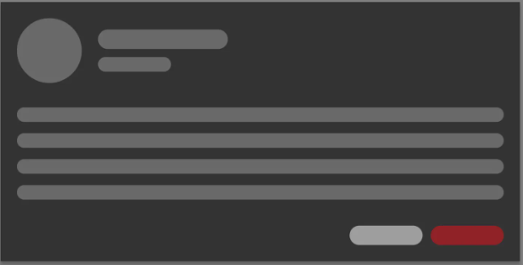
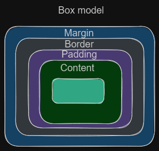
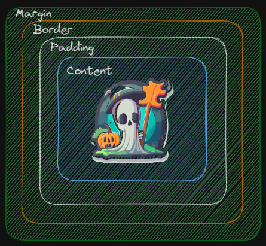

# Table of Contents

- [Basics CSS](#basics-css)
- [Selectors](#selectors)
- [CSS Properties](#css-properties)
- [CSS Units](#css-units)
- [Width And Length](#width-and-length)
- [CSS Fonts](#font)
- [CSS Color Formats](css-color-formats)
- [CSS Layout](#css-layout)
- [Media Queries](#media-queries)

# CSS

## Introduction to CSS

CSS stands for Cascading Style Sheets and is a stylesheet language used to define the visual presentation of HTML and XML documents. It allows you to control the layout, colors, fonts, and other visual aspects of a web page.

```html
<link rel="stylesheet" type="text/css" href="styles.css">
```

## CSS Syntax

CSS rules consist of a selector and a declaration block. The selector identifies the HTML element(s) to style, and the declaration block contains one or more declarations separated by semicolons. Each declaration consists of a property and a value.

```css
selector {
  property: value;
  property: value;
  /* more declarations... */
}
```

## BEM architecture

Explain the BEM (Block, Element, Modifier) architecture and how it is utilized in your project. Describe the purpose and structure of blocks, elements, and modifiers, and how they interact with each other. Provide examples to demonstrate the BEM naming conventions and guidelines followed in your project.

```css
/* Block */
.button {
  display: inline-block;
  padding: 10px 20px;
  background-color: #f0f0f0;
  color: #333;
  font-weight: bold;
  text-decoration: none;
  border: none;
}

/* Element */
.button__icon {
  display: inline-block;
  margin-right: 5px;
}

/* Modifier */
.button--primary {
  background-color: #007bff;
  color: #fff;
}

.button--large {
  padding: 15px 30px;
  font-size: 1.2em;
}

.button--large-tag {
  /* Additional modifier styles */
  border-radius: 5px;
}
```

### Why should you use BEM?

- Modularity: BEM encourages a modular approach to CSS, making it easier to manage and scale your stylesheets. The block, element, and modifier structure promotes code reuse and separation of concerns.

- Readability: BEM provides a clear and descriptive naming convention. It makes your code more readable and self-explanatory, reducing confusion and improving collaboration among developers.

- Maintainability: With BEM, you have a predictable and structured way of writing CSS. This improves code maintainability as it becomes easier to locate, modify, and update specific styles or components.

- Scalability: BEM is particularly useful for large-scale projects where multiple developers are working together. Its naming conventions and modular structure make it easier to manage and extend the codebase without introducing conflicts or unintended side effects.

### Resource

- [(Article)BEM methodology](https://en.bem.info/methodology/quick-start/)

# Selectors

Selectors are used to target specific HTML elements to apply styles. Here are some commonly used selectors:

## Basic Selectors

### Element Selector

- Element Selector: Selects elements based on their HTML tag name. For example, `p` selects all `<p>` elements.

```html
<p>This is a paragraph.</p>
```
```css
p {
  property: value;
  property: value;
  /* more declarations... */
}
```
### Class Selector

- Class Selector: Selects elements based on their class attribute. It uses a dot (`.`) followed by the class name. For example, `.my-class` selects all elements with the class "my-class".

```html
  <p class="highlight">This is a paragraph with a class of "highlight".</p>
```
```css
.highlight {
  property: value;
  property: value;
  /* more declarations... */
}
```
### ID Selector

- ID Selector: Selects a single element based on its ID attribute. It uses a hash (`#`) followed by the ID name. For example, `#my-id` selects the element with the ID "my-id".

```html
<div id="box">This is a div with an ID of "box".</div>
```
```css

#box {
  property: value;
  property: value;
  /* more declarations... */
}

```
### Inline selector

- Inline selector: In HTML are defined directly within the HTML elements using the `style` attribute. Here's an example of how inline styles look in HTML:

```html
<div style="property: value;">This is a box</div>
```
### Descendant Selector

- Descendant Selector: Targets elements that are descendants of another element.

```html
  <section class="parent">
    <h1>This is the parent element</h1>
    <p>This is a paragraph inside the parent element.</p>
    <article>
      <p>This is a paragraph inside a nested div.</p>
      <span>This is a span element inside the nested div.</span>
    </article>
  </section>
```
```css
.parent p {
  /* CSS properties */
  property: value;
}

.parent span {
  /* CSS properties */
  property: value;
}
```

### Universal Selector

- Universal Selector: Selects all elements on the page. It uses an asterisk (`*`). For example, `*` selects all elements.

```css
* {
  /* CSS properties */
  property: value;
}
```

# CSS Properties

CSS properties define the visual appearance of HTML elements. Some commonly used properties include:

- `width`: Specifies the width of an element.
- `height`: Specifies the height of an element.
- `margin`: Specifies the margin around an element.
- `padding`: Specifies the padding within an element.
- `font-size`: Specifies the size of the font.
- `font-weight`: Specifies the weight or thickness of the font.
- `line-height`: Specifies the height of a line of text.
- `font-family`: Specifies the font family or list of font families for text.
- `border-radius`: Specifies the radius of the border corners.
- `border`: Specifies the border around an element.
- `color`: Specifies the text color.
- `background-color`: Specifies the background color.
- `display`: Specifies how an element should be displayed (e.g., block, inline, inline-block).

## CSS Units

CSS supports various units for specifying measurements. Some common units include pixels (px), percentages (%), em, rem, and viewport units (vw, vh). Understanding and using the appropriate units is important for creating responsive and scalable designs.

### Pixels (px):

- When you need precise control over element sizes or positioning.
- When working with fixed-width elements that should maintain a consistent size across different devices.
- Example: Setting the width of a container to 300 pixels: `.container { width: 300px; }`

### Percentages (%):

- When you want elements to scale proportionally based on the size of their parent container.
- When creating fluid layouts that adapt to different screen sizes.
- Example: Setting the width of a child element to 50% of its parent: `.child { width: 50%; }`

### EM:

- When you want to define sizes relative to the font size of the parent element.
- Useful for creating scalable typography.
- Example: Setting the font size of a paragraph to 1.2 times the font size of its parent: `.parent { font-size: 16px; } .child { font-size: 1.2em; }`

### REM:

- Similar to EM, but relative to the root (html) element's font size.
- Useful for creating scalable layouts and consistent spacing.
- Example: Setting the margin of an element to 1.5 times the root font size: `.element { margin: 1.5rem; }`

### Viewport units (vw, vh):

- When you want to size elements relative to the viewport's width or height.
- Useful for creating responsive designs that adapt to different screen sizes.
- Example: Setting the height of an element to 50% of the viewport height: `.element { height: 50vh; }`

# Width And Length

## `<html>` vs `<body>`

- In HTML, the `<html>` tag is the root element of the document, encapsulating the entire content. It represents the HTML document as a whole. This tag is usually placed at the beginning and end of an HTML file.

- The `<body>` tag, on the other hand, represents the main content of the HTML document. It contains all the visible elements that users see when they visit a web page. The `<body>` tag is nested inside the `<html>` tag and typically follows the `<head>` tag, which contains meta information and scripts.

## How backgorund-color works on html and body tags

-  By default, the background color set on the `<html>` tag will apply to the entire page, including areas where there is no content. This means that the background color will extend beyond the visible content of the page. However, when you set the background color on the `<body>` tag, it will only apply to the area containing the actual content of the page. The background color will not extend beyond the content area.

### CSS Font

#### Font sample

```css
@import url('https://fonts.googleapis.com/css?family=Roboto');

.sample-text {
  font-family: 'Roboto', sans-serif;
  font-size: 20px;
  font-weight: bold;
  line-height: 1.5;
}

```

### (Optional)CSS Color Formats

In CSS, there are several color formats you can use to specify colors.

#### Hexadecimal Colors

Hexadecimal colors are represented using a combination of six alphanumeric characters (`#RRGGBB`), where `RR` represents the red value, `GG` represents the green value, and `BB` represents the blue value. For example, `#FF0000` represents pure red.

Hexadecimal colors are widely used in CSS because they provide a large range of colors and are supported by all modern browsers.

```css

/* Hexadecimal Colors */
.hex-color {
  color: #FF0000; /* Red */
  background-color: #00FF00; /* Green */
  border: 2px solid #0000FF; /* Blue border */
  box-shadow: 2px 2px 4px #888888; /* Gray shadow */
}
```

#### Hexadecimal Colors with Transparency

To add transparency to a hexadecimal color, you can use an additional two-digit value at the end of the color code (`#RRGGBBAA`), where `AA` represents the `alpha` or transparency value. For example, `#FF0000FF` represents opaque red, and `#FF000080` represents semi-transparent red.

This format allows you to control the opacity of a color, making it useful for overlays, gradients, and other visual effects.

```css
/* Hexadecimal Colors with Transparency */
.hex-color-transparent {
  color: #FF0000FF; /* Opaque Red */
  background-color: #FF000080; /* Semi-transparent Red */
  border: 2px solid #00FFFF80; /* Semi-transparent Cyan border */
  box-shadow: 2px 2px 4px rgba(0, 0, 0, 0.5); /* Semi-transparent black shadow */
}

```

#### RGB Colors

RGB colors are represented using three numeric values for red, green, and blue, respectively (`rgb(R, G, B)`). Each value ranges from `0` to `255`, representing the intensity of each color channel. For example, `rgb(255, 0, 0)` represents pure red.

RGB colors provide a convenient way to specify colors using familiar numeric values, making them easy to understand and manipulate.

```css
/* RGB Colors */
.rgb-color {
  color: rgb(255, 0, 0); /* Red */
  background-color: rgb(0, 255, 0); /* Green */
  border: 2px solid rgb(0, 0, 255); /* Blue border */
  box-shadow: 2px 2px 4px rgb(136, 136, 136); /* Gray shadow */
}

```

#### RGBA Colors

Similar to `RGB` colors, `RGBA` colors also represent red, green, and blue values, but with an additional alpha value for transparency (`rgba(R, G, B, A)`). The alpha value ranges from `0` to `1`, where `0` represents fully transparent and `1` represents fully opaque. For example, rgba`(255, 0, 0, 0.5)` represents semi-transparent red.

`RGBA` colors are useful when you need to control the transparency of a color without affecting other elements on the page.

```css
/* RGBA Colors */
.rgba-color {
  color: rgba(255, 0, 0, 0.5); /* Semi-transparent Red */
  background-color: rgba(0, 255, 0, 0.2); /* Semi-transparent Green */
  border: 2px solid rgba(0, 0, 255, 0.8); /* Semi-transparent Blue border */
  box-shadow: 2px 2px 4px rgba(0, 0, 0, 0.3); /* Semi-transparent black shadow */
}

```

#### HSL Colors

`HSL` stands for Hue, Saturation, and Lightness. `HSL` colors use three values: hue (`0 to 360 degrees`), saturation (`0% to 100%`), and lightness (`0% to 100%`) (`hsl(H, S, L)`). Hue represents the color itself, saturation controls the intensity, and lightness determines how light or dark the color is.

HSL colors offer a more intuitive way to manipulate colors, allowing you to adjust hue, saturation, and lightness independently.

```css
/* HSL Colors */
.hsl-color {
  color: hsl(0, 100%, 50%); /* Red */
  background-color: hsl(120, 100%, 50%); /* Green */
  border: 2px solid hsl(240, 100%, 50%); /* Blue border */
  box-shadow: 2px 2px 4px hsl(0, 0%, 53%); /* Gray shadow */
}
```

#### Examples

[Example](https://codesandbox.io/s/kind-feather-wjju44?file=/index.html)

# CSS Layout

- [Box Model](#box-model)
- [Overflow Handling](#overflow-handling)
- [Positioning](#positioning)
- [Display Property](#display-property)

**Explanation:**

**CSS (Cascading Style Sheets) Layout** refers to the technique of positioning and arranging elements on a web page. It plays a crucial role in determining how content is displayed and organized in a web document. CSS Layout enables web designers and developers to control the placement, size, and spacing of elements such as text, images, and other HTML elements within a webpage.



## Box Model

- [CSS Box-Model Diagram](#css-box-model-diagram)
- [Margins vs Padding Property](#margins-vs-padding-property)
- [Border Property](#border-property)
- [Box-sizing Property](#box-sizing-property)

**Explanation:**

 The foundation of CSS layout is the box model. In this model, every element on a webpage is treated as a rectangular box. Each box comprises four core properties: content, padding, border, and margin. These properties collectively dictate the element's size and positioning within the layout.



### CSS Box-Model Diagram

**Explanation:**

Think of the CSS box-model like an *onion*. It has **4 Layers:**

- **1st layer:** Content

- **2nd layer:** Padding

- **3rd layer:** Border

- **4th layer:** Margin



**Example:**

- [Example: CSS Box-Model Diagram](https://codesandbox.io/s/boxmodel-dgyxtj?file=/index.html)

### Margins vs Padding Property

**Explanation:**

**Margins and Padding** are fundamental properties in CSS that control the spacing around and within HTML elements, playing a critical role in the layout and design of web pages. They are used to create space, alignment, and separation between elements.

**Key Concepts:**

- **Margins:** Margins are the spaces outside an element. They define the gap between the element and its adjacent elements. Margins do not have a background color or content, and they effectively separate elements from one another or from the edges of their containing element.

- **Padding:** Padding, on the other hand, is the space within an element, between the element's content and its border. Padding is used to control the distance between an element's content and its border. It affects the size and spacing of the element's content.

**Syntax:**

```css
/* Margin: margin-top margin-right margin-bottom margin-left; */
/* Margin can be set using auto, a length value, a percentage, or other units. */
selector {
    margin: 10px 20px 10px 30px; /* Example setting margins for top, right, bottom, and left sides */
}

/* Padding: padding-top padding-right padding-bottom padding-left; */
/* Padding can also be set using various units and values. */
selector {
    padding: 5% 15px 0 0; /* Example setting padding for top, right, bottom, and left sides */
}
```

### Border Property

**Explanation:**

The `border` property in CSS is used to define the style, width, and color of an element's border. It plays a significant role in the visual design and layout of web pages, helping to create distinctions between elements and improve overall aesthetics.

**Key Concepts:**

1. **Border Style:** The `border-style` property determines the type of border to be displayed. Common values include `solid`, `dotted`, `dashed`, `double`, `none`.

2. **Border Width:** The `border-width` property specifies the thickness of the border. It can take values like `thin`, `medium`, `thick`, or specific measurements in pixels (`px`), `em`, `rem`, etc. You can set different widths for each border side (top, right, bottom, left) or use shorthand notations.

3. **Border Color:** The `border-color` property defines the color of the border. It can accept color names, hexadecimal color codes, RGB values, or other valid color representations. Like border width, you can set different colors for each side or use shorthand notations.

**Syntax:**

```css
selector {
    border: border-style border-width border-color;
}
```

**Example:**

- [Example: Border Property](https://codesandbox.io/s/boxmodelborders-57fz7y?file=/index.html)

### Box-sizing Property

**Explanation:**

The `box-sizing property` in CSS is used to control how an element's total width and height are calculated, particularly in relation to its content, padding, and border. Understanding and using this property is crucial for managing the layout of web elements. 

**Key Concepts:**

- **Content Box (default):** By default, the `box-sizing` property is set to `content-box`. In this mode, an element's width and height only consider the content itself. Padding and border are added to the specified width and height.

- **Border Box:** When `box-sizing` is set to `border-box`, the width and height of an element include the content, padding, and border. This means that the padding and border dimensions are included within the specified width and height, and the content area shrinks accordingly.

**Syntax:**

```css
selector {
    box-sizing: content-box; /* or box-sizing: border-box; */
}
```

## Overflow Handling

**Explanation:**

The CSS overflow property is a valuable tool for managing how content within an HTML element overflows its container when it doesn't fit within the available space. This property allows you to control how the overflow is handled, whether it's hidden, scrollable, or automatically managed.

**Key Concepts:**

1. **Content Overflow:** When the content within an element exceeds the dimensions of its container, it results in content overflow. This commonly occurs with text, images, or elements within fixed-size containers.

2. **`overflow: hidden`:** This value hides any content that overflows the container. It effectively clips or conceals any content extending beyond the container's boundaries, making it invisible to the user.

3. **`overflow: scroll`:** When set to scroll, the container will provide scrollbars to navigate through the overflowing content. Users can scroll to view the hidden content. Scrollbars appear both horizontally and vertically if necessary.

4. **`overflow: auto`:** The auto value dynamically manages the overflow. It hides overflowed content if it fits within the container, and it adds scrollbars if necessary. This value strikes a balance by showing scrollbars only when content overflows.

5. **`overflow-x`:** This property exclusively manages the horizontal overflow. You can use it to control how content that overflows the container's width is handled. Available values include `hidden` to hide overflow, scroll to add horizontal `scrollbars`, and `auto` to manage overflow dynamically.

6. **`overflow-y`:** `overflow-y` is used to exclusively manage the vertical overflow. It helps you determine how content that overflows the container's height is managed. Similar to `overflow-x`, it supports values like `hidden`, `scroll`, and `auto` to control vertical overflow.

7. **`overflow-wrap: normal`:** This is the default value, and it allows words to break only at permitted break points (such as spaces or hyphens). Words that cannot fit within the container's width without breaking at a permitted point will overflow the container.

8. **`overflow-wrap: break-word`:** When set to `break-word`, the property allows words to break at any point, even if it's not a permitted break point. This prevents long words from overflowing the container and ensures they wrap to the next line as needed.

**Syntax:**

```css
element {
    overflow: value;
    overflow-x: value;
    overflow-y: value;
    overflow-wrap: value;

}
```

- `element`: Replace this with the selector for the HTML element for which you want to manage overflow.

- `overflow`: Specify one of the values (`hidden`, `scroll`, or `auto`) to control the overall overflow behavior.

- `overflow-x`: Specify one of the values (`hidden`, `scroll`, or `auto`) to control horizontal overflow.

- `overflow-y`: Specify one of the values (`hidden`, `scroll`, or `auto`) to control vertical overflow.

- `overflow-wrap`: Specify one of the values (`normal` or break-`word`) to control word wrapping behavior.

**Example:**

- [Example: overflow](https://codesandbox.io/s/overflow-smlj8q?file=/index.html)

## Positioning

- [Position Property](#position-property)
- [z-index Property](#z-index-property)
- [Float Property](#float-property)

**Explanation:**

CSS provides different methods to position elements within a layout.

### Position Property

**Explanation:**

The CSS `position` property is a fundamental tool for controlling the positioning of elements within a web page's layout. It enables you to manipulate an element's position in relation to its normal flow within the document. This property offers four distinct values: `relative`, `absolute`, `fixed`, and `sticky`, each of which has a specific effect on how the element is positioned.

**Key Concepts:**

1. `relative`: When an element is set to `position: relative`, it allows you to adjust its position relative to its normal flow location. The element retains its space in the layout, meaning it may affect the positioning of surrounding elements. You can use properties like `top`, `right`, `bottom`, and `left` to shift the element from its original position while preserving the layout's integrity.

2. `absolute`: Using `position: absolute`, you position an element relative to its closest positioned ancestor. If no ancestor is positioned (by setting `position: relative`, `position: absolute`, or `position: fixed`), the element is positioned relative to the initial containing block (usually the viewport). This makes it suitable for creating overlays, dropdown menus, or positioning elements precisely in the layout without affecting the flow of other elements.

3. `fixed`: With `position: fixed`, an element is fixed in the viewport, regardless of scrolling. It's commonly employed for elements like navigation bars that should remain visible while the page is scrolled. Fixed elements don't affect the layout of other elements and are positioned in relation to the viewport.

4. `sticky`: The `position: sticky` property is used to create elements that act as if they're `relative` until they reach a defined scroll position and then switch to `fixed` positioning. This is useful for creating headers or sidebars that become fixed when they reach a specific point on the screen, providing a smooth scrolling experience.

**Syntax:**

```css
element {
    position: value;
    /* Additional positioning properties can be used with certain values */
}
```

- `element`: Replace this with the selector for the HTML element you want to position.
- `value`: Choose one of the following values: `relative`, `absolute`, `fixed`, or `sticky`.

Additional properties, like `top`, `right`, `bottom`, and `left`, can be used to fine-tune the position of an element when position is set to relative or absolute.

**Example:**

- [Example: Position Property](https://codesandbox.io/s/posistioncss-2296wj?file=/index.html)

### z-index Property

**Explanation:**

The CSS `z-index` property is a crucial tool for controlling the stacking order of elements in a web page when they overlap. It plays a fundamental role in creating layered layouts and managing which elements appear on top of others. The `z-index` property allows you to specify the order in which elements are rendered, with elements having higher `z-index` values displayed in front of those with lower values. While `z-index` is commonly used in conjunction with the `position` property (`position: absolute` or `position: relative`), it's important to note that using `z-index` doesn't require setting the `position` property.

**Key Concepts:**

1. **Stacking Order**: The stacking order determines the visual hierarchy of elements on a web page. Elements are stacked on top of one another in the order in which they appear in the HTML document. By default, elements with later declarations in the document are rendered on top of earlier ones. The `z-index` property allows you to modify this order and control how elements overlap and interact.

2. **Higher Values, Closer to the Top**: When you set a higher `z-index` value for an element, it places that element closer to the top of the stacking order. Elements with higher `z-index` values will be displayed in front of elements with lower `z-index` values, effectively determining which elements appear on top of others in the visual layout.

3. **Using `position`:** While it's not mandatory, `z-index` is often used in combination with the position property. When an element is positioned with `position: absolute` or `position: relative`, you can apply `z-index` to control the stacking order of elements within the positioned context. Elements with the same position value, like `relative` or `absolute`, are compared based on their `z-index` values.

**Syntax:**

```css
element {
    z-index: value;
}
```

- `element`: Replace this with the selector for the HTML element to which you want to apply the `z-index` property.

- `value`: Assign a numerical value to indicate the stacking order. Higher values bring elements closer to the top.

**Example:**

- [Example: z-index Property](https://codesandbox.io/s/posistioncss-2296wj?file=/index.html)

### Float Property

**Explanation:**

The CSS `float` property is a layout property used to shift an element to the left or right within its containing element. This positioning allows text and other elements to wrap around the floated element. While `float` was historically used for creating layouts with floated elements, it has been largely replaced by more modern layout techniques like Flexbox and CSS Grid. `float` is primarily used for specific purposes like creating text-wrapping behavior.

**Key Concepts:**

1. **Floating Elements:** When an element is floated, it is removed from the normal flow of the document and shifted to the left or right within its containing element. This allows other elements, such as text, to wrap around the floated element. It's commonly used for aligning images within a block of text or creating multi-column layouts.

2. **Historical Usage:** In the past, `float` was a common technique for creating complex page layouts. It allowed web designers to achieve desired positioning effects. However, it had limitations and quirks, which led to the development of more robust layout techniques like Flexbox and CSS Grid.

3. **Text Wrapping:** One of the primary uses of `float` is to create text-wrapping behavior around images or other floated elements. This can enhance the readability and aesthetics of a page by integrating content more harmoniously with visuals.

**Syntax:**

```css
element {
    float: value;
}
```

- `element`: Replace this with the selector for the HTML element you want to apply the `float` property to.

- `value`: Specify either `left` or `right` to determine the direction in which the element should be floated.

**Example:**

- [Example: float](https://codesandbox.io/s/recursing-mountain-vg8wzh?file=/index.html)

## Display Property

- [Block vs Inline vs Inline-block Value](#block-inline-inline-block-value)
- [Flexbox Value](#flexbox-value)
- [Grid Value](#grid-value)

**Explanation:**

**Display Property:** The display property specifies how an HTML element is rendered. It can take various values such as `block`, `inline`, `inline-block`, `flex`, `grid`, and more. Each value influences how the element interacts with its surrounding elements and how it flows within the layout.

### Block vs Inline vs Inline-block Value

**Explanation:**

In CSS, the `display` property is used to define how an HTML element should be displayed in the layout. Three common values for the `display` property are `block`, `inline`, and `inline-block`. These values determine the box type and flow behavior of the element, significantly impacting its layout and interaction with other elements.

**Key Concepts:**

1. **Block Elements (`display: block`):** Elements with `display: block` create a block-level box in the layout. They typically start on a new line and take up the full width of their containing element. Block-level elements are suitable for structural components like headings, paragraphs, divs, and containers.

2. **Inline Elements (`display: inline`):** Elements with `display: inline` generate an inline-level box, which flows within the text of a block-level container. Inline elements do not start on a new line, and their width is determined by the content they contain. Common inline elements include text, links, and inline images.

3. **Inline-Block Elements (`display: inline-block`):** `display: inline-block` combines characteristics of both block-level and inline-level elements. Inline-block elements are placed inline, allowing other inline content to flow around them, but they can have width, height, margins, and padding, just like block-level elements. This makes inline-block elements useful for creating inline text alongside block-level components, such as icons next to text.

**Syntax:**

```css
element {
    display: value;
}
```

- `element`: Replace this with the selector for the HTML element you want to apply the `display` property to.
- `value`: Use one of the values (`block`, `inline`, or `inline-block`) to specify how the element should be displayed.

**Example:**

- [Example: Block vs Inline vs Inline-block Value](https://codesandbox.io/s/block-vs-inline-vs-inline-block-value-vg8wzh)

### Flexbox Value

**Explanation:**

The CSS Flexbox layout model, short for "Flexible Box," is a powerful layout system designed for one-dimensional layouts, which can be oriented as either rows or columns. It provides the ability to create flexible and dynamic layouts, align elements, and distribute space efficiently. Flexbox is particularly useful for building a wide range of web page components, such as navigation menus, grids, and complex alignment scenarios.

**Key Concepts:**

1. **One-Dimensional Layouts:** Flexbox is designed to handle one-dimensional layouts, either in a row (horizontally) or a column (vertically). It excels in situations where you need to arrange elements in a single direction, making it well-suited for creating responsive designs and arranging content side by side or stacked.

2. **Flexible and Dynamic:** Flexbox allows you to create layouts that adapt to the available space, making it excellent for building responsive web designs. Elements within a flex container can expand or contract to fit the container's width or height, maintaining a consistent and visually appealing layout.

3. **Alignment and Distribution:** Flexbox provides powerful alignment and distribution capabilities. You can easily control the alignment of items within a flex container, both along the main axis and the cross axis. This includes options for centering, distributing space, and handling content of varying sizes.

4. **Applications:** Flexbox is commonly used for a variety of web components, including navigation menus, card layouts, sidebars, and responsive designs. It simplifies the process of creating complex layouts that would be challenging with traditional CSS techniques.

**Syntax:**

```css
.container {
  display: flex | inline-flex; /* Defines the container as a block-level or inline-level flex container */
  
  flex-direction: row | row-reverse | column | column-reverse; /* Main axis direction */
  
  flex-wrap: nowrap | wrap | wrap-reverse; /* Wrapping behavior */
  
  justify-content: flex-start | flex-end | center | space-between | space-around | space-evenly; /* Main axis alignment */
  
  align-items: flex-start | flex-end | center | baseline | stretch; /* Cross axis alignment */
  
  align-content: flex-start | flex-end | center | space-between | space-around | stretch; /* Cross axis alignment for multiple lines */
}
```

**Example:**

- [Example: Flexbox Value](https://codesandbox.io/s/flex-s37skd?file=/index.html)

### Grid Value

**Explanation:**

The CSS Grid layout system is a versatile two-dimensional grid-based layout model that enables the creation of complex layouts with rows and columns. It's particularly well-suited for designing grid-based web layouts, including multi-column web pages, image galleries, and responsive designs. CSS Grid provides precise control over the placement and alignment of elements within the grid.

**Key Concepts:**

1. **Two-Dimensional Layout:** CSS Grid differs from other layout models like Flexbox, as it operates in two dimensions, allowing you to define both rows and columns. This capability is particularly useful for creating grid-based structures where elements are positioned in both horizontal and vertical axes.

2. **Grid Container and Grid Items:** In CSS Grid, you have a grid container, which is an element that defines the grid context. Within the grid container, you place grid items, which are the elements you want to position within the grid. Grid items are positioned based on the grid lines defined by the container.

3. **Precise Placement:** CSS Grid offers fine-grained control over the placement of grid items. You can specify the size of rows and columns, control the alignment of items, and even create complex layouts, such as asymmetrical grids and overlapping items.

4. **Responsive Design:** Grid is highly adaptable for responsive web design. It allows you to change the layout and grid structure based on the available screen width or height, making it ideal for building designs that adapt to various devices and screen sizes.

**Syntax:**

**Example:**

# Media Queries

Media queries enable you to apply different styles based on the characteristics of the user's device or browser. They are commonly used for creating responsive designs that adapt to different screen sizes.

## Introduction

## How do media queries work?

Media queries consist of a media type and one or more expressions that define the conditions for the styles to be applied. When a media query is encountered, the browser evaluates the conditions and determines whether or not to apply the styles within the media query block.

## Why should you use media queries?

1. **Responsive Web Design**: Media queries are essential for creating responsive web designs that adapt to different devices and screen sizes.
2. **Improved User Experience**: With media queries, you can tailor your content and design based on the device's capabilities, improving readability and usability.
3. **Future-Proofing**: Media queries allow your website to adapt and remain functional across a wide range of devices.

## Mobile-First Approach

In this approach, you design and develop your website primarily for mobile devices and then progressively enhance it for larger screens.

```css
/* Base styles for mobile devices */
body {
  font-size: 16px;
}

/* Media query for tablets */
@media screen and (min-width: 768px) {
  body {
    font-size: 18px;
  }
}

/* Media query for desktops */
@media screen and (min-width: 1024px) {
  body {
    font-size: 20px;
  }
}
```


## Hide/Show Elements

Media queries can also be used to hide or show elements based on screen size.

```css
/* Base styles for all screens */
.container {
  display: block;
}

/* Media query to hide an element on mobile devices */
@media screen and (max-width: 600px) {
  .container {
    display: none;
  }
}
```

# (Optional)Advance Selectors

## Advance Selectors

### Pseudo-classes

**Pseudo-classes**: Selects elements based on a specific state or condition.

```css
/*:hover - selects an element when the mouse pointer is over it: */
button:hover {
  background-color: yellow;
}
```

```css
/* :focus - selects an element when it has keyboard focus: */
input:focus {
  border-color: blue;
}
```

```css
/* :first-child - selects the first child element of its parent: */
ul li:first-child {
  font-weight: bold;
}
```

```css
/* :nth-child() - selects elements based on their position within their parent: */
ul li:nth-child(odd) {
  background-color: lightgray;
}
```

### Code example

- [Pseudo-classes](https://codesandbox.io/s/smoosh-water-37rntk?file=/index.html)

### Child Selector

**Child Selector**: Selects elements that are direct children of another element. It uses a greater than sign (>). For example, `article > p` selects all `<p>` elements that are direct children of a `<article>` element.

```css
article > p {
  /* CSS properties */
  property: value;
}
```

```html
<article>
  <p>This paragraph will be selected</p>
  <div>
    <p>This paragraph will NOT be selected</p>
  </div>
</article>
```

### Adjacent Sibling Selector

Adjacent Sibling Selector: Selects an element that immediately follows another element. It uses a plus sign (+). For example, `h2 + p` selects the `<p>` element that immediately follows an `<h2>` element.


```css
h2 + p {
  /* CSS properties */
  property: value;
}
```

```html
<h2>Title</h2>
<p>This paragraph will be selected</p>
<p>This paragraph will NOT be selected</p>
<h2>Another Title</h2>
<p>This paragraph will be selected</p>
```

### General Sibling Selector

General Sibling Selector: Selects elements that follow another element. It uses a tilde (~). For example, `h2 ~ p` selects all `<p>` elements that follow an `<h2>` element.

```css
h2 ~ p {
  /* CSS properties */
  property: value;
}
```

```html
<h2>Title</h2>
<p>This paragraph will be selected</p>
<p>This paragraph will also be selected</p>
<div>
  <p>This paragraph will be selected</p>
</div>
<h2>Another Title</h2>
<p>This paragraph will be selected</p>
```

### Code example

- [Sibling Selector](https://codesandbox.io/s/sibling-selector-4x8dwc)

### Attribute Selector

Attribute Selector: Selects elements based on their attribute values. It uses square brackets ([]). For example, `[type="text"]` selects all elements with `type="text"` attribute.

```html
<a href="https://example.com">This is a link</a>
<input type="text" placeholder="Enter your name" />

```

```css
a[href="https://example.com"] {
  /* CSS properties */
  property: value;
}
```

```css
input[type="text"] {
  /* CSS properties */
  property: value;
}
```

```css
img[alt="An image"] {
  /* CSS properties */
  property: value;
}
```

### Code example

- [Attribute Selector](https://codesandbox.io/s/attribute-selector-x47lpq)

### More selectors

1. `:active`: Applies styles when an element is being activated, such as when it is clicked and held down.

2. `:disabled`: Applies styles to disabled elements, preventing user interaction.

3. `:enabled`: Applies styles to enabled elements, allowing user interaction.

4. `:checked`: Applies styles to checked radio buttons or checkboxes.

5. `:required`: Applies styles to required form fields.

6. `:optional`: Applies styles to optional form fields.

7. `:valid`: Applies styles to form elements with valid input.

8. `:invalid`: Applies styles to form elements with invalid input.

9. `:last-child`: Applies styles to the last child element of its parent.

10. `:nth-of-type()`: Selects elements based on their position among elements of the same type. It also takes a formula as an argument.

11. `:nth-last-child()`: Selects elements based on their position among the list of siblings, counting from the last child.

12. `:nth-last-of-type()`: Selects elements based on their position among elements of the same type, counting from the last element.

13. `:not()`: Selects elements that do not match a specific selector. For example, `:not(.my-class)` selects elements that do not have the class "my-class".

14. `:root`: The :root selector represents the root element of the document, which is typically the `<html>` element. It is often used to define global CSS variables that can be accessed and reused throughout the stylesheet.

15. `::before` and `::after`: The `:before` and :`after` selectors are used to insert content before or after an element. They are known as pseudo-elements because they create virtual elements that can be styled separately from the actual content of an element.

### Code example

- [More selectors](https://codesandbox.io/s/dreamy-joliot-krgqn4?file=/index.html)
